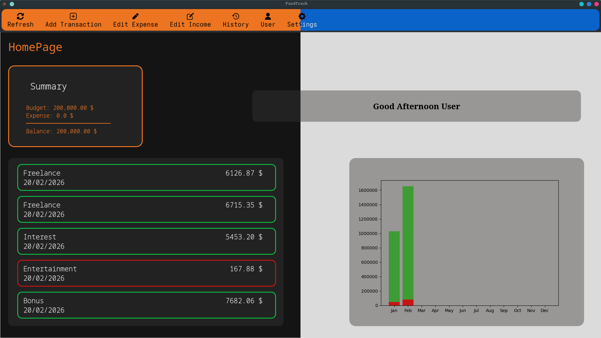
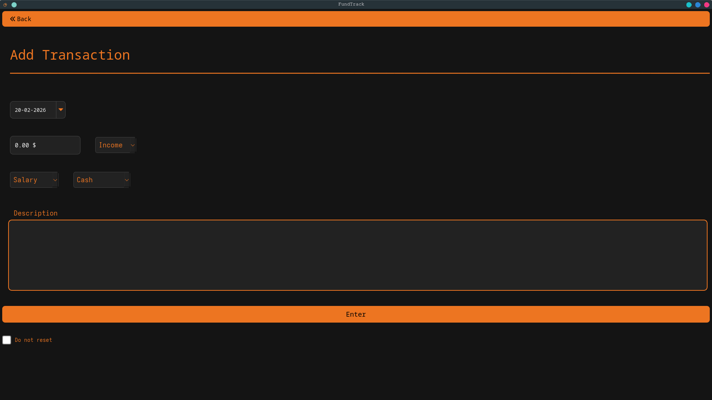
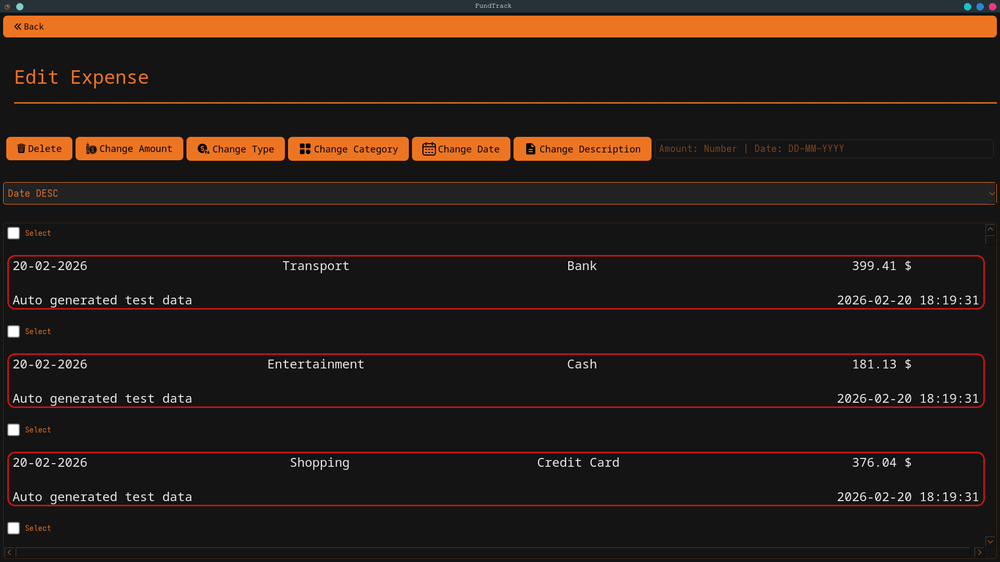
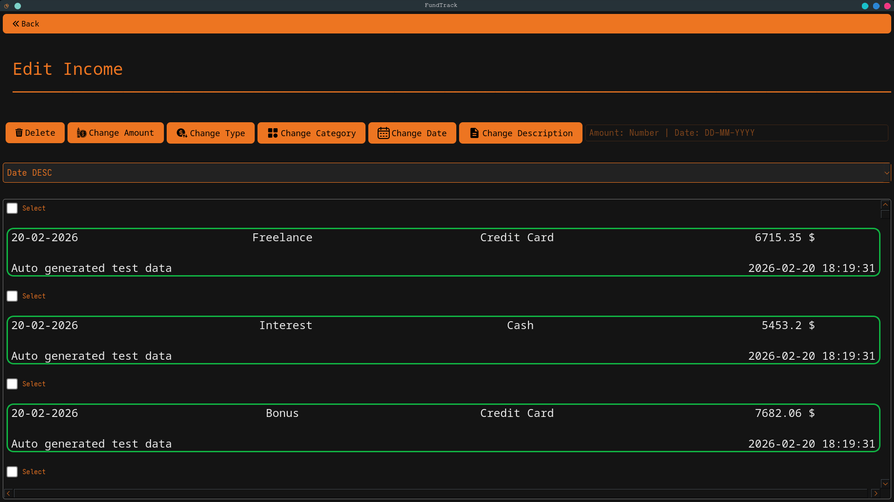
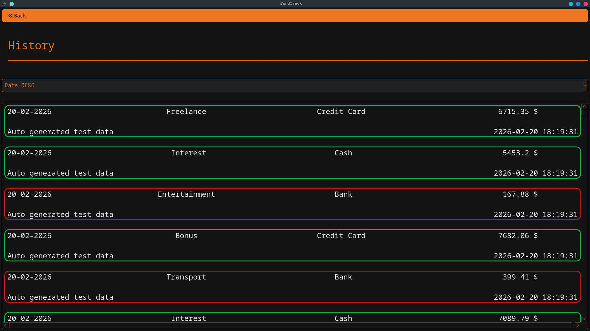
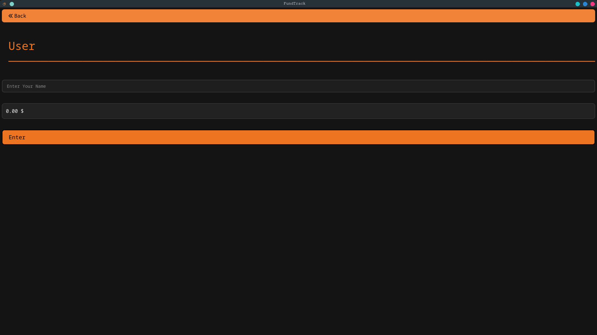
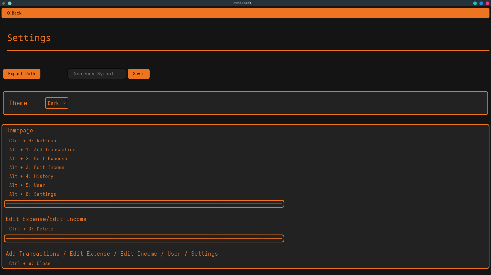

# Fund Track


Fund Track is personal finance manager program that is built using Python. It can be used by anyone to track their personal finances.
## Features
- Add expenses and sources of income
- Edit expenses and sources of income
- Transaction history list
- Budget Setting
- Automatic .txt finance report exporting
- Changeable currency symbol
- Shortcuts to open each function of the program and to close it

## Demo
### 1. Homescreen


### 2.Add Transaction Screen


### 3. Edit Expenses Screen


### 4. Edit Incomes Screen


### 5. Transaction History Screen


### 6. User Profile Screen


### 7. Settings Screen

‎ 
‎ 
## Installation
### Requirements
- Pyside6 
- Matplotlib 

## Usage
Run the file 
```python
main.py
``` 

## LICENSE


## Contributing
Pull requests are welcome. For major changes.